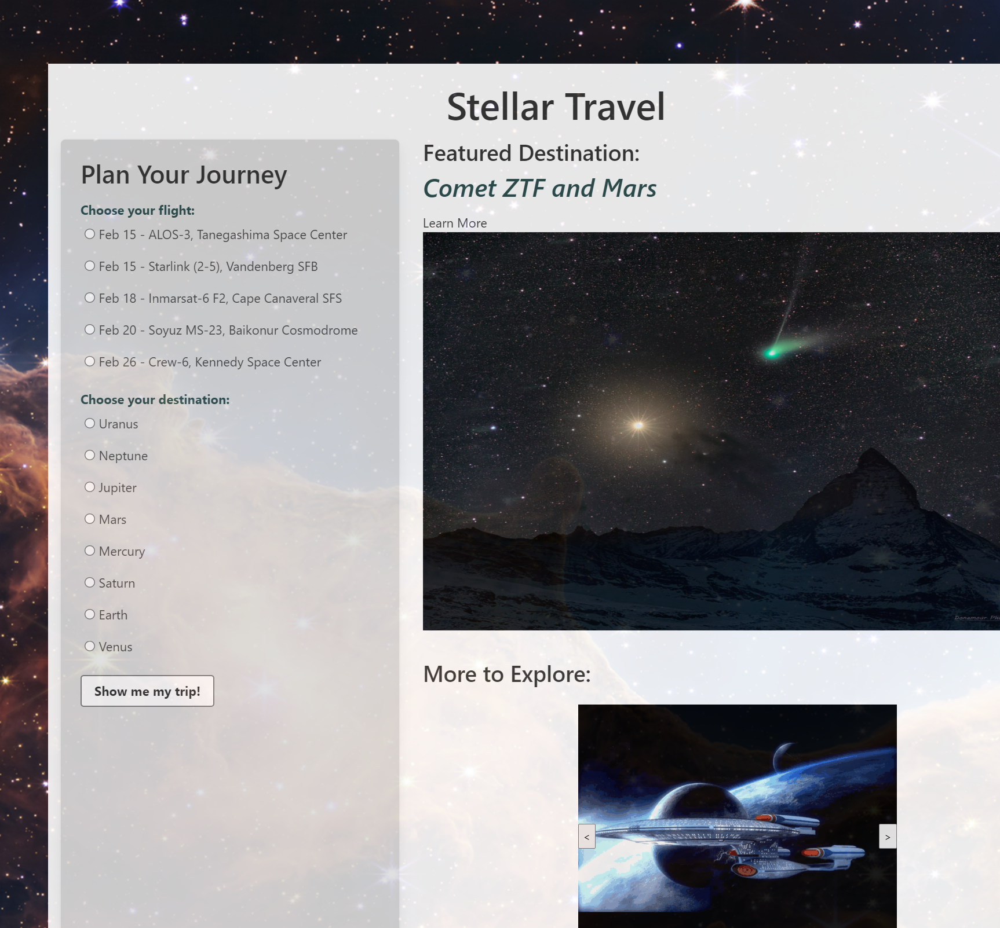

# ***Stellar Travels***

## Description

There are plenty of websites that can help you plan a trip anywhere on Earth. But that’s not enough anymore. Space is the next go-to destination, so our group has created Stellar Travels, an easy-to-use website to get people there.

## User Story

***As a traveler,*** I want to have access to a website where I can plan my trip through space. 

***As a traveler,*** I need the space traveling website to provide me options to select which planet I want to visit and on which flight.

***As a traveler,*** I need to know more details about the planet I am planning to visit.

***As a traveler,*** I want to see images of the aircraft I would by flying on and places I might visit.

## Link

[**Click Here** to view the deployed website!](https://abmetheny.github.io/trip-planning-of-the-future)

## Future Developments

- Display additional planetary data as it becomes available with improved technology

- Add sub-types to destinations as we take manned flights beyond our solar system

- Add a date picker to choose from more than just the next 5 rocket launches

- Add Videos from the former visitors when they return

- Add a rating/comment system for traveler feedback

## Credits

Amy Metheny
Andrew Robbins
Ruchi Agarwal

